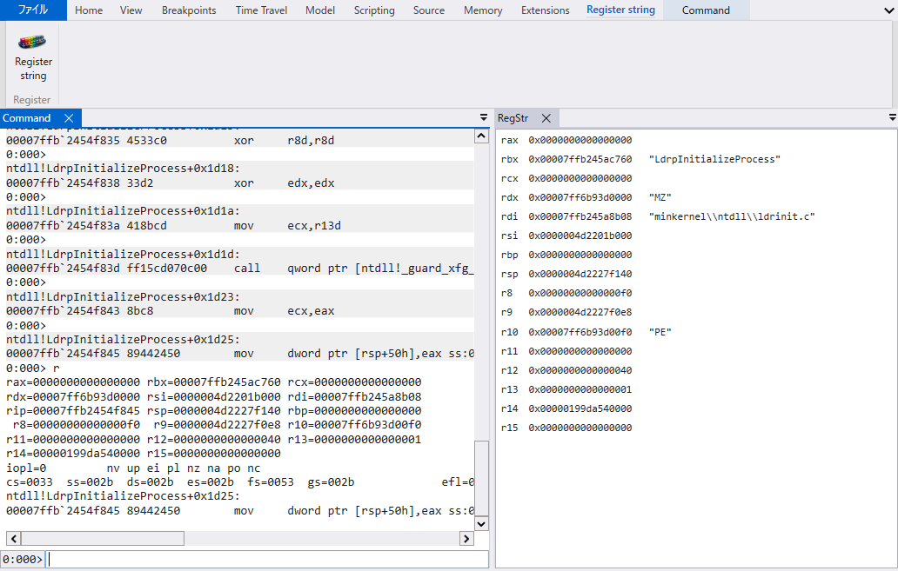
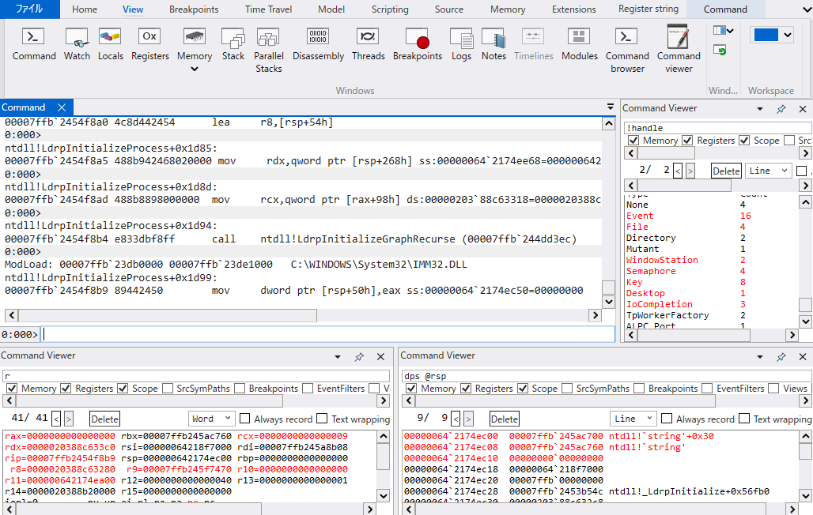
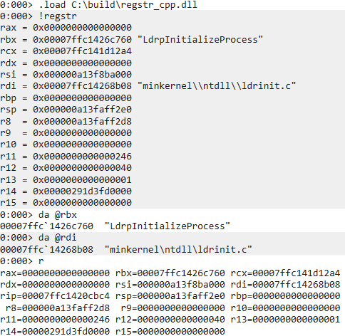

# regstr

English / [日本語](./README_ja.md)

Sample WinDbg command & UI extensions.

## Features

- regstr command extension: If a register value can be interpreted as an ASCII string, it also displays that string
- RegStr UI extension: Displays register values and strings in the RegStr tool window according to the execution state
- Command Viewer UI extension: A command execution window that updates on every step. Supports history and highlighting differences in command output

## Test environment

- Windows 11
- WinDbg 1.2601.12001.0
- Windows SDK 10.0.26100.7627
- Visual Studio 2026 18.3.2

## Usage

### Installation

#### Command extension

Note: Only supports debugging x64 applications.

Note: `regstr_c.dll`, `regstr_cpp.dll`, `regstr_cpp2.dll`, and `regstr_rs.dll` have different implementations, but all provide the same functionality. If you use them, use only one of them.

1. Download and extract the prebuilt zip from the [Releases](https://github.com/FFRI/regstr/releases) page
2. Launch WinDbg, debug any x64 application, and load the DLL with `.load <absolute path to the DLL>`. The DLL is one of `regstr_*.dll`
3. Confirm that the `!regstr` command is available

If you want it to be loaded automatically at startup, copy the entire `UserExtensions` folder to `%LOCALAPPDATA%\DBG\`.

#### UI extension

Note: Operation is not guaranteed on WinDbg versions other than the one listed above.

RegStr:

Note: Only supports debugging x64 applications.

1. Download and extract the prebuilt zip from the [Releases](https://github.com/FFRI/regstr/releases) page
2. Create a `UIExtensions` folder under `%LOCALAPPDATA%\DBG`, and place `RegStr.dll` inside it
3. When you start WinDbg, a `Register string` tab will be added. Click the `Register string` button inside it to open the `RegStr` window
4. Debug any x64 application, and register information will be displayed in the `RegStr` window

Command Viewer:

1. Download and extract the prebuilt zip from the [Releases](https://github.com/FFRI/regstr/releases) page
2. Create a `UIExtensions` folder under `%LOCALAPPDATA%\DBG`, and place `CommandViewer.dll` and [`DiffPlex.dll`](https://github.com/mmanela/diffplex) inside it
3. When you start WinDbg, a `Command viewer` button will be added to the `View` tab. Click it to open the `Command Viewer` window
4. Debug any application and enter any command into the text box at the top; the command output will be displayed

## Build

Building the C version:

1. Open `c\regstr.slnx` in Visual Studio
2. Copy `engextcpp.cpp` and `engextcpp.hpp` from `%PROGRAMFILES(X86)%\Windows Kits\<version>\Debuggers\inc`, and modify them so they can be compiled
3. Build (this produces `regstr_c.dll`, `regstr_cpp.dll`, and `regstr_cpp2.dll`)

Building the Rust version:

1. Command extension: In the `rust` folder, run `cargo build --release` (this produces `regstr_rs.dll`)

Building RegStr:

1. Open `ui\RegStr\RegStr.slnx` in Visual Studio
2. Build (this produces `RegStr.dll`)

Building Command Viewer:

1. Open `ui\CommandViewer\CommandViewer.slnx` in Visual Studio
2. Build (this produces `CommandViewer.dll`)

## References

For implementation details, please refer to our blog post How to implement WinDbg extensions (in Japanese) [Part 1 - Command Extension](https://engineers.ffri.jp/entry/2026/03/30/000000), Part 2 (coming soon), Part 3 (coming soon).

## LICENSE

[Apache License, Version 2.0](./LISENCE)
