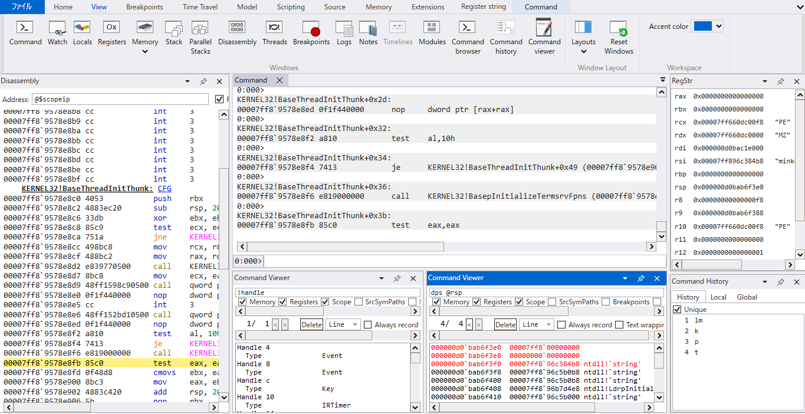
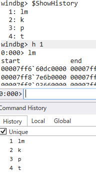

# regstr

[English](./README.md) / 日本語

WinDbg コマンド拡張 & UI 拡張機能サンプル。

## 機能

- regstr コマンド拡張: レジスタの値が ASCII 文字列として解釈可能な場合にその文字列も表示
- RegStr UI 拡張: 実行状態に合わせて RegStr ツールウィンドウ上にレジスタ値と文字列を表示
- Command History UI 拡張: コマンド履歴の保持、ピン留め、再実行
- Command Viewer UI 拡張: ステップ実行毎に更新されるコマンド実行ウィンドウ。履歴保持、コマンド出力差分の強調

## テスト環境

- Windows 11
- WinDbg 1.2603.20001.0
- Windows SDK 10.0.26100.7627
- Visual Studio 2026 18.5.2

## 使い方

### インストール

#### コマンド拡張

注) regstr 拡張は x64 アプリケーションのデバッグのみ対応しています。

注) `regstr_c.dll`, `regstr_cpp.dll`, `regstr_cpp2.dll`, `regstr_rs.dll` は実装方法が異なるだけで機能はすべて同じです。使用する場合はいずれか一つだけ使用してください。

1. [Releases](https://github.com/FFRI/regstr/releases) ページからビルド済み zip をダウンロードおよび解凍
2. WinDbg を起動し、適当な x64 アプリケーションをデバッグ、`.load <DLL の絶対パス>` で DLL を読み込む。DLL は `regstr_*.dll` のいずれか
3. `!regstr` コマンドが使用できることを確認

起動時に自動で読み込ませたい場合、`UserExtensions` フォルダを丸ごと `%LOCALAPPDATA%\DBG\` にコピーしてください。

#### UI 拡張

注) UI 拡張は上記に記載した WinDbg バージョン以外での動作は保証できません。

RegStr:

注) RegStr は x64 アプリケーションのデバッグのみ対応しています。

1. [Releases](https://github.com/FFRI/regstr/releases) ページからビルド済み zip をダウンロードおよび解凍
2. `%LOCALAPPDATA%\DBG` フォルダ内に `UIExtensions` フォルダを作成し、その中に `RegStr.dll` を入れる
3. WinDbg を起動すると `Register string` タブが増えているので、その中にある `Register string` ボタンをクリックすると `RegStr` ウィンドウが出現する
4. 適当な x64 アプリケーションをデバッグすると `RegStr` ウィンドウにレジスタの情報が表示される

Command History:

1. [Releases](https://github.com/FFRI/regstr/releases) ページからビルド済み zip をダウンロードおよび解凍
2. `%LOCALAPPDATA%\DBG` フォルダ内に `UIExtensions` フォルダを作成し、その中に `CommandHistory.dll` を入れる
3. WinDbg を起動すると `View` タブに `Command history` ボタンが追加されているため、それをクリックすると `Command History` ウィンドウが出現する
4. 適当なアプリケーションをデバッグすると、コマンド履歴が表示される

Command Viewer:

1. [Releases](https://github.com/FFRI/regstr/releases) ページからビルド済み zip をダウンロードおよび解凍
2. `%LOCALAPPDATA%\DBG` フォルダ内に `UIExtensions` フォルダを作成し、その中に `CommandViewer.dll` と [`DiffPlex.dll`](https://github.com/mmanela/diffplex) を入れる
3. WinDbg を起動すると `View` タブに `Command viewer` ボタンが追加されているため、それをクリックすると `Command Viewer` ウィンドウが出現する
4. 適当なアプリケーションをデバッグし、適当なコマンドを上部のテキストボックスに入力すると、コマンド出力が表示される

## ビルド

c のビルド:

1. `c\regstr.slnx` を Visual Studio で開く
2. `%PROGRAMFILES(X86)%\Windows Kits\<バージョン>\Debuggers\inc` に入っている engextcpp.cpp および engextcpp.hpp をコピーし、コンパイルできるように修正
3. ビルド (`regstr_c.dll`, `regstr_cpp.dll`, `regstr_cpp2.dll` がビルドされます)

rust のビルド:

1. コマンド拡張: `rust` フォルダで `cargo build --release` を実行 (`regstr_rs.dll` がビルドされます)

RegStr のビルド:

1. `ui\RegStr\RegStr.slnx` を Visual Studio で開く
2. ビルド (`RegStr.dll` がビルドされます)

CommandHistory のビルド:

1. `ui\CommandHistory\CommandHistory.slnx` を Visual Studio で開く
2. ビルド (`CommandHistory.dll` がビルドされます)

CommandViewer のビルド:

1. `ui\CommandViewer\CommandViewer.slnx` を Visual Studio で開く
2. ビルド (`CommandViewer.dll` がビルドされます)

## References

実装の詳細については我々のブログ記事 WinDbg 拡張機能の作り方 [1 ～ コマンド拡張編](https://engineers.ffri.jp/entry/2026/03/30/000000), [2 ～ UI 拡張編](https://engineers.ffri.jp/entry/2026/05/18/000000), 3 (後ほど公開) をご覧ください。

## LICENSE

[Apache License, Version 2.0](./LISENCE)
